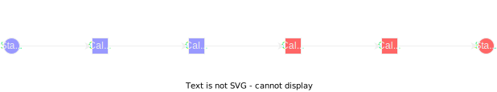

# FSM for Golang with generic

Statum is an FSM for Golang with generic for strong type.

## Example

From `examples/simple`:

```go
package main

import (
	"context"
	"log"

	"github.com/nqd/statum"
)

func main() {
	type state string
	type transaction string

	const (
		stateClosed state       = "closed"
		stateOpen   state       = "open"
		tranOpen    transaction = "open"
		tranClose   transaction = "close"
	)

	config := statum.NewStateMachineConfig[state, transaction]().
		AddState(stateOpen, statum.WithPermit(tranClose, stateClosed)).
		AddState(stateClosed, statum.WithPermit(tranOpen, stateOpen))

	fsm, err := statum.NewFSM[state, transaction](stateOpen, config)
	if err != nil {
		log.Panicln("failed to create new fsm", err)
	}

	log.Println("Current state:", fsm.Current())

	err = fsm.Fire(context.Background(), tranClose)
	if err != nil {
		log.Panicln("Failed to create trigger close transaction")
	}

	log.Println("Current state:", fsm.Current())
}
```

## Callbacks

Statum support callbacks when entering/exit a specific state or any state.

a. To add a callback en entering or exit a specific state:

```go
	conf := statum.NewStateMachineConfig[state, transaction]().
		AddState(stateClosed,
			statum.WithPermit(tranOpen, stateOpen),
		).
		AddState(stateOpen,
			statum.WithPermit(tranClose, stateClosed),
			statum.WithOnEnterState(d.enterOpenState),
			statum.WithOnLeaveState(d.leaveOpenState),
		)


func (d *Door) enterOpenState(_ context.Context, e *statum.Event[state, transaction]) error {
	// will be called before FSM entering stateOpen state
}

func (d *Door) leaveOpenState(_ context.Context, e *statum.Event[state, transaction]) error {
	// will be called when FSM exit stateOpen state
}
```

b. To add callbacks when entering/exit any state:

```go
	conf := statum.NewStateMachineConfig[state, transaction]().
		AddState(stateClosed,
			statum.WithPermit(tranOpen, stateOpen),
		).
		AddState(stateOpen,
			statum.WithPermit(tranClose, stateClosed),
		).
		OnEnterAnyState(d.enterState).
		OnLeaveAnyState(d.leaveState)


func (d *Door) enterState(_ context.Context, e *statum.Event[state, transaction]) error {
	// will be called when FSM enter any state (stateOpen, stateClosed)
}

func (d *Door) leaveState(_ context.Context, e *statum.Event[state, transaction]) error {
	// will be called when FSM leave any state (stateOpen, stateClosed)
}
```

### Order of callbacks



### Cancelling a transition

Any observer can cancel a transition by returning an error during any of the following callbacks:
- leave a state (WithOnLeaveState)
- leave any state (OnLeaveAnyState)

Any subsequence registered callbacks will be cancelled and state will remain unchanged.